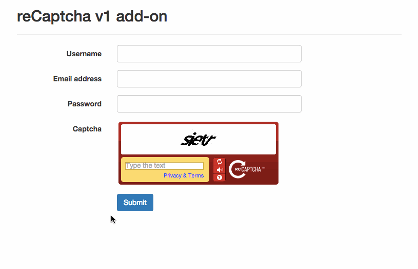
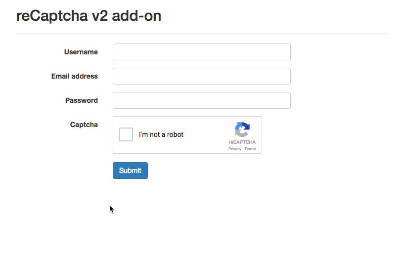

reCaptcha add-on
================

This add-ons shows and validates a Google reCAPTCHA.

Support both reCAPTCHA v1:

and v2:

## Usage

See the following documentation for usages:

* [http://formvalidation.io/addons/recaptcha1/](Use reCaptcha1 add-on)
* [http://formvalidation.io/addons/recaptcha2/](Use reCaptcha2 add-on)

## Releases

* v0.4.0 (2015-08-26): Add `reset()` method to reset the captcha
* v0.3.1 (2015-08-10): The reCaptcha2 add-on adds support for passing the `stoken` parameter
* v0.3.0 (2015-03-25):
    - Support multiple reCAPTCHA v2 elements on the same page
    - Add minified files

* v0.2.0 (2015-02-09): Add localization support for reCaptcha2
* v0.1.0 (2015-02-02): First release